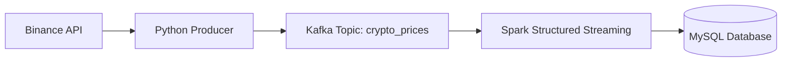

## 1. Purpose of This Document

This document provides a complete architectural description of the **Real-Time Crypto Streaming Pipeline**, including:

- System components  
- Data flow  
- Processing logic  
- Infrastructure layout  
- Data models  
- Design decisions and constraints  

The structure and language follow enterprise documentation standards used by organizations such as AWS, Databricks, and Confluent.

---

## 2. High-Level Architecture Overview

The pipeline implements a continuous streaming architecture composed of five layers:

1. **Source Layer** – Binance API  
2. **Ingestion Layer** – Python Producer  
3. **Streaming Layer** – Apache Kafka  
4. **Processing Layer** – Apache Spark Structured Streaming  
5. **Storage Layer** – MySQL  

### High-Level Architecture Diagram



---

## 3. Component Architecture

### 3.1 Source Layer – Binance API

- Provides real-time cryptocurrency price data.  
- Queried every second by the ingestion component.  
- Returns JSON payloads containing symbol, price, and timestamp.  

---

### 3.2 Ingestion Layer – Python Producer

Location in repository:

```
src/producers/btc_producer.py
```

Responsibilities:

- Poll the Binance API at a fixed interval.  
- Normalize and validate the response payload.  
- Serialize data into JSON format.  
- Publish messages to the Kafka topic `crypto_prices`.  

Key characteristics:

- Stateless  
- Fault-tolerant (automatic retries)  
- Decoupled from downstream processing  

---

### 3.3 Streaming Layer – Apache Kafka

Provisioned via `docker-compose.yml`.

Components:

- **Zookeeper** – coordination service  
- **Kafka Broker** – message storage and distribution  

Topic:

- `crypto_prices`

Kafka provides:

- Durability  
- Horizontal scalability  
- Backpressure handling  
- Decoupling between ingestion and processing  

---

### 3.4 Processing Layer – Spark Structured Streaming

Location in repository:

```
src/processors/stream_processor.py
```

Responsibilities:

- Consume messages from Kafka in real time.  
- Parse JSON into a structured DataFrame.  
- Apply schema enforcement and type casting.  
- Execute a **1-minute tumbling window** aggregation.  
- Compute average price per symbol.  
- Persist aggregated results into MySQL using JDBC.  

Processing guarantees:

- Exactly-once semantics (within Spark constraints)  
- Fault tolerance via checkpointing (optional extension)  
- Micro-batch execution model  

---

### 3.5 Storage Layer – MySQL

MySQL stores the aggregated results produced by Spark.

Table: `moving_averages`

Schema:

```sql
CREATE TABLE moving_averages (
    id INT AUTO_INCREMENT PRIMARY KEY,
    start_time DATETIME,
    end_time DATETIME,
    symbol VARCHAR(10),
    average_price DECIMAL(20, 8),
    created_at TIMESTAMP DEFAULT CURRENT_TIMESTAMP
);
```

Purpose:

- Persist aggregated metrics  
- Enable analytical queries  
- Provide a reliable historical record  

---

## 4. Data Flow Description

### 4.1 End-to-End Data Flow

1. The Python Producer retrieves live prices from the Binance API.  
2. The producer publishes JSON messages to Kafka.  
3. Kafka stores messages in the `crypto_prices` topic.  
4. Spark Structured Streaming continuously reads from Kafka.  
5. Spark applies:
   - JSON parsing  
   - Schema enforcement  
   - Windowing (1-minute tumbling)  
   - Aggregation (average price per symbol)  
6. Spark writes aggregated results to MySQL.  
7. MySQL stores the data for downstream analytics or dashboards.  

---

## 5. Data Models

### 5.1 Kafka Message Schema

```json
{
  "symbol": "BTCUSDT",
  "price": "43200.12",
  "timestamp": 1700000000.123
}
```

### 5.2 Spark Internal Schema

| Field      | Type     |
|------------|----------|
| symbol     | STRING   |
| price      | DOUBLE   |
| timestamp  | DOUBLE   |

### 5.3 MySQL Storage Schema

| Column        | Type              |
|---------------|-------------------|
| start_time    | DATETIME          |
| end_time      | DATETIME          |
| symbol        | VARCHAR(10)       |
| average_price | DECIMAL(20,8)     |
| created_at    | TIMESTAMP         |

---

## 6. Infrastructure Architecture

### 6.1 Docker Compose

The `docker-compose.yml` file provisions:

- Kafka Broker  
- Zookeeper  
- Internal Docker network  
- Listener configuration for local development  

### 6.2 Local Development Environment

- Operating System: Ubuntu  
- IDE: PyCharm  
- Database: Local MySQL instance  
- Python Virtual Environment: `.venv`  

---

## 7. Design Decisions

### 7.1 Kafka as the Message Broker

Chosen for:

- High throughput  
- Durability  
- Horizontal scalability  
- Decoupling between ingestion and processing  

### 7.2 Spark Structured Streaming for Processing

Chosen for:

- Native Kafka integration  
- Windowing and watermarking support  
- Fault tolerance  
- Distributed processing capabilities  

### 7.3 MySQL as the Storage Layer

Chosen for:

- Simplicity  
- Low-latency reads  
- Compatibility with BI tools  
- Ease of local development  

---

## 8. Limitations and Constraints

- The pipeline depends on Binance API availability.  
- Spark runs in local mode (not a distributed cluster).  
- MySQL is not optimized for high-throughput streaming workloads.  
- Kafka configuration is simplified for development purposes.  

---

## 9. Future Architectural Enhancements

- Deploy Kafka using AWS MSK.  
- Run Spark on EMR, Databricks, or Kubernetes.  
- Store aggregated data in a data lake (S3 + Iceberg/Delta).  
- Add Grafana dashboards for real-time visualization.  
- Introduce Schema Registry for data governance.  

---

## 10. References

- Apache Kafka Documentation  
- Apache Spark Structured Streaming Guide  
- Binance API Documentation  
- MySQL Reference Manual  

---

**End of Document**
