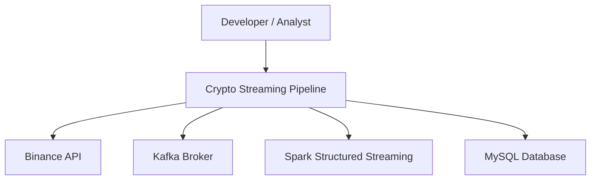
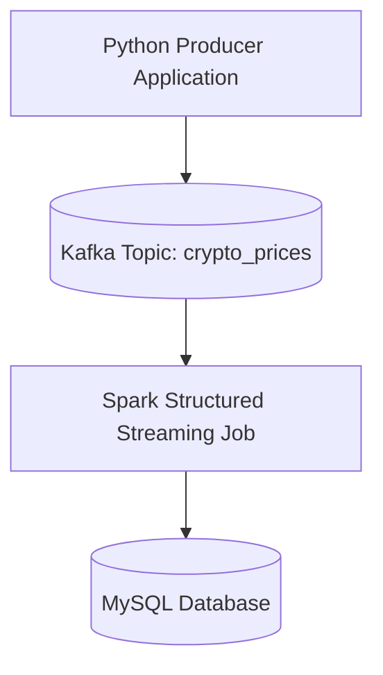
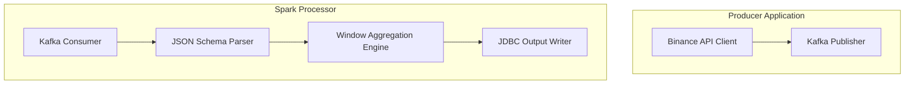

# C4 Model Documentation  
Real-Time Crypto Streaming Pipeline  
Repository: crypto-realtime-streaming

---

## 1. Purpose of This Document

This document describes the system architecture using the **C4 Model**, a structured approach for visualizing software architecture at multiple levels of abstraction:

- Level 1: System Context  
- Level 2: Container View  
- Level 3: Component View  
- Level 4: (Optional) Code View  

This documentation follows enterprise standards used by organizations such as AWS, Confluent, and Databricks.

---

## 2. Level 1 – System Context Diagram

This diagram shows the system as a whole and how it interacts with external actors and systems.

### Description

- **Developer/Analyst** interacts with the system for monitoring, debugging, and analytics.  
- **Binance API** provides real-time cryptocurrency price data.  
- **Kafka** acts as the ingestion and buffering layer.  
- **Spark Structured Streaming** processes data in real time.  
- **MySQL** stores aggregated results for downstream consumption.

---

## 3. Level 2 – Container View

This diagram shows the major containers (applications, services, databases) that make up the system.

### Container Responsibilities

| Container | Responsibilities |
|----------|------------------|
| Python Producer | Fetches data from Binance API and publishes messages to Kafka. |
| Kafka Broker | Stores and distributes streaming messages. |
| Spark Structured Streaming | Consumes Kafka messages, applies windowing and aggregation, writes results to MySQL. |
| MySQL Database | Stores aggregated moving averages for analytics. |

---

## 4. Level 3 – Component View

This diagram breaks down each container into its internal components.

### Component Responsibilities

#### Producer Application
- **APIClient**  
  - Sends HTTP requests to Binance API  
  - Validates and normalizes responses  

- **KafkaPublisher**  
  - Serializes payloads  
  - Publishes messages to Kafka topic  

#### Spark Processor
- **KafkaConsumer**  
  - Reads messages from Kafka in micro-batches  

- **SchemaParser**  
  - Converts JSON into Spark DataFrame  
  - Enforces schema and data types  

- **WindowAggregator**  
  - Applies 1-minute tumbling windows  
  - Computes average price per symbol  

- **JDBCWriter**  
  - Writes aggregated results to MySQL  

---

## 5. Level 4 – Code View (Optional)

This level is optional in enterprise documentation.  
Below is a high-level mapping of code modules to components.

| Component | Code Location |
|----------|----------------|
| APIClient | `src/producers/btc_producer.py` |
| KafkaPublisher | `src/producers/btc_producer.py` |
| KafkaConsumer | `src/processors/stream_processor.py` |
| SchemaParser | `src/processors/stream_processor.py` |
| WindowAggregator | `src/processors/stream_processor.py` |
| JDBCWriter | `src/processors/stream_processor.py` |

---

## 6. Architectural Rationale

- The C4 model provides a clear, hierarchical view of the system.  
- It supports onboarding, audits, and architectural reviews.  
- It aligns with enterprise documentation standards.  

---

## 7. References

- C4 Model: https://c4model.com  
- Apache Kafka Documentation  
- Apache Spark Structured Streaming Guide  
- Binance API Documentation  

---

**End of Document**