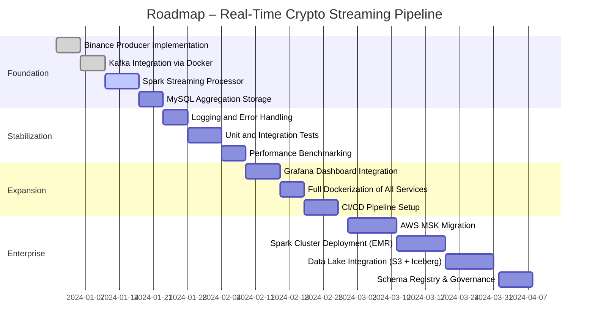

## 1. Purpose of This Document

This roadmap outlines the planned evolution of the Real-Time Crypto Streaming Pipeline.  
It provides a structured timeline for feature development, architectural enhancements, and operational improvements.

The roadmap follows enterprise planning standards and is intended for engineering leadership, contributors, and stakeholders.

---

## 2. Roadmap Overview

The project roadmap is divided into phases that reflect increasing maturity:

1. **Foundation Phase** – Core ingestion and streaming pipeline  
2. **Stabilization Phase** – Reliability, monitoring, and testing  
3. **Expansion Phase** – Visualization, orchestration, and cloud readiness  
4. **Enterprise Phase** – Scalability, governance, and production deployment  

---

## 3. Gantt Timeline

---

## 4. Phase Descriptions

### 4.1 Foundation Phase
Focus: Build the core streaming pipeline.

Deliverables:
- Binance API ingestion  
- Kafka topic creation and configuration  
- Spark Structured Streaming job  
- MySQL storage layer  

Status: **In progress**

---

### 4.2 Stabilization Phase
Focus: Improve reliability and maintainability.

Deliverables:
- Structured logging  
- Error handling and retry logic  
- Unit tests for ingestion and processing  
- Integration tests for Kafka → Spark → MySQL  
- Performance benchmarks  

Status: **Planned**

---

### 4.3 Expansion Phase
Focus: Add observability, orchestration, and automation.

Deliverables:
- Grafana dashboards for real-time metrics  
- Dockerization of producer and processor  
- CI/CD pipeline (GitHub Actions or GitLab CI)  
- Automated environment provisioning  

Status: **Planned**

---

### 4.4 Enterprise Phase
Focus: Production-grade scalability and governance.

Deliverables:
- Migration to AWS MSK  
- Spark cluster deployment (EMR, Databricks, or Kubernetes)  
- Data lake integration (S3 + Iceberg/Delta)  
- Schema Registry for Kafka  
- Data governance and lineage  

Status: **Future**

---

## 5. Risks and Dependencies

| Risk | Impact | Mitigation |
|------|---------|------------|
| Binance API rate limits | Medium | Implement caching and exponential backoff |
| Kafka local environment instability | Medium | Move to containerized or cloud-managed Kafka |
| Spark local mode limitations | High | Migrate to distributed cluster |
| MySQL write throughput | Medium | Introduce batching and indexing |

---

## 6. Success Criteria

The project is considered successful when:

- Real-time ingestion and processing operate continuously without data loss  
- Aggregated metrics are stored reliably in MySQL  
- Monitoring and alerting are in place  
- The system can scale to additional symbols and higher throughput  
- Cloud deployment is feasible with minimal refactoring  

---

## 7. Revision History

| Version | Date | Description |
|---------|------|-------------|
| 1.0 | 2024-01-01 | Initial roadmap creation |
| 1.1 | 2024-01-15 | Added enterprise phase and risks |
| 1.2 | 2024-01-20 | Updated timelines and deliverables |

---

**End of Document**